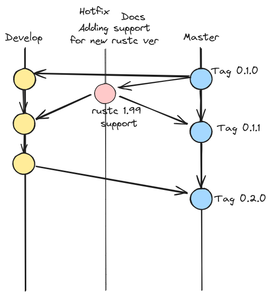

# Contributing to BugStalker

You likely come here from the issues or pull requests page. There are some
suggestions on how to make your contribution most useful.

## File an issue

Consider using a bug report/feature request template. Feel free to adapt it for
your needs. You can opt out and start from a blank issue, but be mindful of the
completeness of the information.

There are feature requests of different kinds:

* A complement to existing functionality or another ready-to-implement request.
* A new idea or something else that requires a discussion.

The former is completely okay to be asked via an issue.

## Open a pull request

The main purpose of the BugStalker development model is to provide two things:

1) all updates related to the release of new versions of `rustc` must
   be released as quickly as possible
2) the development and addition of new features
   shouldn't interfere with the first point

That is why BugStalker using a developing model similar to GitFlow.
There is a stable `master` branch and a `develop` branch with development
changes for the next release.
All changes into this project may be grouped into two big groups — features and
improvements.

If you want to add a new feature:

* create your own branch from `develop`
* implement feature
* create pull request into `develop` branch

If you want to send an improvement (a bugfix, readme fix,
or add support for one of `rustc` versions):

* create your own branch from `master`
* implement improvement
* create pull requests into `master` and `develop` branch

## Useful links

* [GitFlow] -- https://nvie.com/posts/a-successful-git-branching-model/
