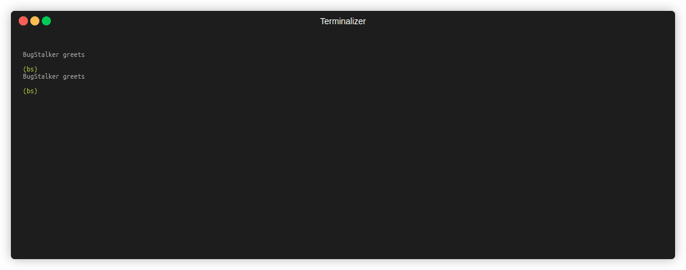

# BugStalker

> Modern debugger for Linux x86-64. Written in Rust for Rust programs.



---

# Table of Contents

- [BugStalker](#bugstalker)
    * [Supported rustc versions](#supported-rustc-versions)
    * [Features](#features)
    * [Installation](#installation)
    * [Start debugger session](#start-debugger-session)
    * [Help](#help)
    * [Start and restart](#start-and-restart)
    * [Stopping and continuing](#stopping-and-continuing)
        * [Breakpoints](#breakpoints)
        * [Watchpoints](#watchpoints)
        * [Steps](#steps)
        * [Signals](#signals)
    * [Examining the stack](#examining-the-stack)
    * [Examining source files](#examining-source-files)
    * [Examining data](#examining-data)
    * [Async rust](#async-rust)
        * [Async backtrace](#async-backtrace)
        * [Async steps](#async-steps)
    * [Other commands](#other-commands)
    * [Tui interface](#tui-interface)
        * [Configuration](#configuration)
    * [Oracles](#oracles)
- [Contributing](#contributing)

---

## Supported rustc versions

- 1.75
- 1.76
- 1.77
- 1.78
- 1.79
- 1.80
- 1.81
- 1.82
- 1.83
- 1.84

---

## Features

* written in rust for rust language with simplicity as a priority goal
* [breakpoints, steps, signals, watchpoints](#stopping-and-continuing)
* multithreaded application support
* [data query expressions](#examining-data)
* support for a rust type system (collections, smart pointers, thread locals and
  many others), not only for printing but also for interaction
* two ui types: console and [tui](#tui-interface), switch available at any
  moment
* [oracle](#oracles) as an extension mechanism
* builtin [tokio oracle](#oracles) -
  like [tokio_console](https://github.com/tokio-rs/console) but there is no need
  to make changes to the source codes
* and much more!

---

## Installation

First check if the necessary dependencies
(`pkg-config` and `libunwind-dev`) are installed:

For example, ubuntu/debian:

```shell
apt install pkg-config libunwind-dev
```

For example, fedora:

```shell
dnf install pkg-config libunwind-devel
```

Now install debugger:

```shell
cargo install bugstalker
```

That's all, `bs` command is available now!

<details>
  <summary>Problem with libunwind?</summary>
If you have any issues with `libunwind`, you can try to install `bs` with
native unwinder 
(currently, I don't recommend this method because libunwind is better :))

```shell
cargo install bugstalker --no-default-features
```

</details>

### Distro Packages

<details>
  <summary>Packaging status</summary>

[](https://repology.org/project/bugstalker/versions)

</details>

#### Arch Linux

```shell
pacman -S bugstalker
```

#### Nix package manager

There's flake which you can use to start using it.
Just [enable flakes](https://wiki.nixos.org/wiki/Flakes#Enable_flakes_temporarily)
then you're able to use it with:

```
nix run github:godzie44/BugStalker
```

`bugstalker` also provides a package which you can include to your NixOS config.
For example:

<details>

```nix
{
  inputs = {
    nixpkgs.url = "github:nixos/nixpkgs/nixos-unstable";
    bugstalker.url = "github:godzie44/BugStalker";
  };

  outpus = {nixpkgs, bugstalker, ...}: {
    nixosConfigurations.your_hostname = nixpkgs.lib.nixosSystem {
      modules = [
        ({...}: {
          environment.systemPackages = [
            # assuming your system runs on a x86-64 cpu
            bugstalker.packages."x86_64-linux".default
          ];
        })
      ];
    };
  };
}
```

</details>

##### Home-Manager

There's a home-manager module which adds `programs.bugstalker` to your home-manager config.
You can add it by doing the following:

<details>

```nix
{
  description = "NixOS configuration";

  inputs = {
    nixpkgs.url = "github:nixos/nixpkgs/nixos-unstable";
    home-manager.url = "github:nix-community/home-manager";
    home-manager.inputs.nixpkgs.follows = "nixpkgs";
    bugstalker.url = "github:godzie44/BugStalker";
  };

  outputs = inputs@{ nixpkgs, home-manager, bugstalker, ... }: {
    nixosConfigurations = {
      hostname = nixpkgs.lib.nixosSystem {
        system = "x86_64-linux";
        modules = [
          ./configuration.nix
          home-manager.nixosModules.home-manager
          {
            home-manager.sharedModules = [
              bugstalker.homeManagerModules.default
              ({...}: {
                programs.bugstalker = {
                  enable = true;
                  # the content of `keymap.toml`
                  keymap = {
                    common = {
                      up = ["k"];
                    }
                  };
                };
              })
            ];
          }
        ];
      };
    };
  };
}
```

</details>

---

## Start debugger session

To start with program from binary file use:

```shell
bs my_cool_program
```

Or with arguments:

```shell
bs my_cool_program -- --arg1 val1 --arg2 val2
```

Or attach to program by its pid:

```shell
bs -p 123
```

## Help

Print `help` for view all available commands.

## Start and restart

[demo](https://github.com/godzie44/BugStalker/blob/master/doc/demo_run.gif)

- `run` - start or restart a program (alias: `r`)

## Stopping and continuing

The Debugger stops your program when breakpoints are hit,
or after watchpoint are hit,
or after steps commands,
or when the OS signal is coming.
BugStalker always stops the whole program, meaning that all threads are stopped.
Thread witch initiated a stop become a current selected thread.

### Continue execution

[demo](https://github.com/godzie44/BugStalker/blob/master/doc/demo_cont.gif)

- `continue` - resume a stopped program

### Breakpoints

[demo](https://github.com/godzie44/BugStalker/blob/master/doc/demo_brkpt.gif)

- `break {file}:{line}` - set breakpoint at line (alias: `b {file}:{line}`)
- `break {function name}` - set breakpoint at start of the function (
  alias: `b {function_name}`)
- `break {instruction address}` - set breakpoint at instruction (
  alias: `b {instruction address}`)
- `break remove {number}` - remove breakpoint by its number (
  alias: `b r {number}`)
- `break remove {file}:{line}` - remove breakpoint at line (
  alias: `b r {file}:{line}`)
- `break remove {function name}` - remove breakpoint at start of the function (
  alias: `b r {function name}`)
- `break info` - print all breakpoints

### Watchpoints

[demo](https://github.com/godzie44/BugStalker/blob/master/doc/demo_watch.gif)

Watchpoint is a "data breakpoint".
This means that the program stops when the variable (or expression, or just raw memory region)
observed by watchpoint is changed.
Currently, watchpoints feature based on `x86-64` hardware breakpoints.
Therefore, there are two limitations:

- only 4 watchpoints are possible at one time
- watchpoint "observe" memory region of 1/2/4/8 bytes size

You can set watchpoint at variables (global or locals), or at expression based on variables.
Watchpoints for local variables will be removed automatically, when variable out of scope.
If watchpoint observes a global variable, then it will live as long as the debugger is running.

Lets look at examples:

- `watch my_var` - stop when variable value is rewriting (alias: `w my_var`)
- `watch +rw my_var` - stop when variable value is reading or rewriting
- `watch my_vector[0]` - stop when first vector element is rewriting
- `watch (~my_vector).len` - stop when vector length is changed
- `watch 0x100:4` - stop when writing to memory region [0x100:0x103]

### Steps

[demo](https://github.com/godzie44/BugStalker/blob/master/doc/demo_step.gif)

- `stepi` - step a single instruction
- `step` - step a program until it reaches a different source line (
  alias: `stepinto`)
- `next` - step a program, stepping over subroutine (function) calls (
  alias: `stepover`)
- `finish` - execute a program until selected stack frame returns (
  alias: `stepout`)

### Signals

[demo](https://github.com/godzie44/BugStalker/blob/master/doc/demo_signal.gif)

`BugStalker` will catch signals sent from OS to debugee program and stop execution.
For example, try to send SIGINT (ctrl+c) to the debugee program to stop it.

### Change current selected thread

[demo](https://github.com/godzie44/BugStalker/blob/master/doc/demo_thread.gif)

- `thread info` - print list with information about threads
- `thread current` - prints current selected thread
- `thread switch {number}` - switch selected thread

## Examining the stack

When your program has stopped,
the first thing you need to know is where it stopped and how it got there.

Each time your program performs a function call,
the information about where in your program the call was made from is saved in a
block of data
called a stack frame.
The frame also contains the arguments of the call and the local variables of the
function
that was called.
All the stack frames are allocated in a region of memory called the call stack.

### Stack frames

The call stack is divided up into contiguous pieces called stack frames.
Each frame is the data associated with one call to one function.
The frame contains the arguments given to the function,
the function's local variables,
and the address at which the function is executed.

### Backtrace

[demo](https://github.com/godzie44/BugStalker/blob/master/doc/demo_bt.gif)

- `backtrace` - print backtrace of current stopped thread (alias: `bt`).
  Backtrace contains information about thread
  (number, pid, address of instruction where thread stopped)
  and all frames starting with the currently executing frame (frame zero),
  followed by its caller (frame one), and on up the stack.
- `backtrace all` - print backtraces of all active threads (alias: `bt all`).

### Select a frame

[demo](https://github.com/godzie44/BugStalker/blob/master/doc/demo_frame.gif)

Most commands
for examining the stack and other data in your program works
on whichever stack frame is selected at the moment.

- `frame info` - print information about current selected frame.
- `frame switch {num}` - change current selected frame.

## Examining source files

[demo](https://github.com/godzie44/BugStalker/blob/master/doc/demo_source.gif)

BugStalker can print parts of your program's source code.
When your program stops,
the debugger spontaneously prints the line where it stopped.
There is `source` commands for print more.

- `source fn` - print current selected function
- `source {num}` - print lines range [current_line-num; current_line+num]
- `source asm` - print assembly representation of current selected function

## Examining data

[demo](https://github.com/godzie44/BugStalker/blob/master/doc/demo_data.gif)

Of course, you need a way to examine data of your program.

- `var {expression}|locals` command for print local and global variables
- `arg {expression}|all` command for print a function arguments

These commands accept expressions as input or have a special mode
(`var locals` print all local variables, `args all` print all arguments).

### Expression

BugStalker has a special syntax for explore program data.
You can dereference references, get structure fields,
slice arrays or get elements from vectors by its index (and much more!).

Operator available in expressions:

- select variable by its name (ex. `var a`)
- dereference pointers/references/smart pointers (ex. `var *ref_to_a`)
- take a structure field (ex. `var some_struct.some_field`)
- take an element by index or key from arrays, slices, vectors, hashmaps (
  ex. `var arr[1]` or even `var hm[{a: 1, b: 2}]`)
- slice arrays, vectors, slices (ex. `var some_vector[1..3]`
  or `var some_vector[1..]`)
- cast constant address to a pointer of a concrete type (
  ex. `var (*mut SomeType)0x123AABCD`)
- take address (ex. `var &some_struct.some_field`)
- show canonic representation (for example, show vector header instead of vector data `var ~myvec`)
- parentheses for control an operator execution ordering

Write expressions is simple, and you can do it right now!
Some examples:

- `var *some_variable` - dereference and print value of `some_variable`
- `var hm[{a: 1, b: *}]` - print value from hashmap corresponding to the key.
  Literal `{a: 1, b: *}` matches to any structure with field `a` equals to 1 and field `b` equals to any value
- `var some_array[0][2..5]` - print three elements, starts from index 2 from
  zero element of `some_array`
- `var *some_array[0]` - print dereferenced value of `some_array[0]`
- `var &some_array[0]` - print address of `some_array[0]`
- `var (~some_vec).len` - print len field from vector header
- `var (*some_array)[0]` - print a zero element of `*some_array`
- `var *(*(var1.field1)).field2[1][2]` - print dereferenced value of element at
  index 2 in
  element at index 1 at field `field2` in dereferenced value of field `field1`
  at variable var1 🤡

## Async rust

Now BugStalker support some commands for interaction with async runtimes (currently only tokio multithread runtime is
supported).
There is also `oracle tokio`, but it adds some overhead to your program and
is not very informative unlike the commands presented below.

Supported `tokio` versions:

- 1.40
- 1.41

### Async backtrace

[demo async backtrace](https://github.com/godzie44/BugStalker/blob/master/doc/demo_async_bt.gif)

While debugging an asynchronous application, you may want to control the state of your application.
If it were a regular synchronous application, you could use the `backtrace` command,
unfortunately for an application with an asynchronous runtime, this command is of little use.

Therefore, BugStalker presents a family of commands: "asynchronous backtrace". With their help
you can get information about the state of your asynchronous runtime -
the state of asynchronous workers and blocking threads, as well as information about each task in the system,
including its current state and its own "backtrace" - a stack of futures starting from the root.

- `async backtrace` - show information about tokio async workers and blocking threads (alias: `async bt`).
  It contains worker/blocking thread id, worker local tasks queue info, currently executed tasks for each worker.
- `async backtrace all` - same as previous (alias: `async bt all`), but contains information about all tasks in the
  system.
  Each task contains an id, and represents as a futures stack, where one future wait for other, and so on.
- `async task {regex}` - print all task with root async functions with names matched to regex. If regex are empty
  then print active task.

### Async steps

An async step works like a usual step (step, stepover, stepout) but in the context of the current task. In other words, an async step guarantees that your application stops at the current task or when the current task moves into a completed state.

[demo async stepover](https://github.com/godzie44/BugStalker/blob/master/doc/demo_async_bt.gif)
- `async stepover` - step a program, stepping over subroutine (function) calls, ends if task going into a completed state (alias: `async next`).

[demo async stepout](https://github.com/godzie44/BugStalker/blob/master/doc/demo_async_stepout.gif)
- `async stepout` - execute the program until the current task moves into the completed state (alias: `async finish`).


## Other commands

Of course, the debugger provides many more commands:

- `symbol {name or regex}` - print symbol kind and address
- `memory read {addr}` - read debugged program memory (alias: `mem read`)
- `memory write {addr} {value}` - write into debugged program memory (
  alias: `mem write`)
- `register read {reg_name}` - print value of register by name (x86_64 register
  name in lowercase) (alias: `reg read`)
- `register write {reg_name} {value}` - set new value to register by name (
  alias: `reg write`)
- `register info` - print list of registers with it values (alias: `reg info`)
- `sharedlib info` - show list of shared libraries
- `quit` - exit the BugStalker (alias: `q`)

## Tui interface

[demo](https://github.com/godzie44/BugStalker/blob/master/doc/demo_tui.gif)

One of the most funny BugStalker features is switching between old school
terminal interface and pretty tui at any moment.

- `tui` - switch too terminal ui (in tui use `Esc` for switch back)

### Configuration

There is a `keymap.toml` file with tui keybindings configuration.
You can find the default configuration files
at https://github.com/godzie44/BugStalker/tree/master/src/ui/tui/config/preset/keymap.toml.

To override any of the defaults, begin by creating the corresponding file (from the file linked above) to:
`~/.config/bs/keymap.toml`.
You can change keybindings configuration file by exporting the `KEYMAP_FILE` environment variable.

## Oracles

[demo console](https://github.com/godzie44/BugStalker/blob/master/doc/demo_oracle.gif)

[demo tui](https://github.com/godzie44/BugStalker/blob/master/doc/demo_oracle_tui.gif)

Oracle is a module that expands the capabilities of the debugger.
Oracles can monitor the internal state of a program
to display interesting information.
For example, tokio oracle is able
to provide information about tokio runtime during program debugging without the
need
to change the source code.
You must run the debugger with enabled oracle, for example, for tokio oracle:

```bash
bs --oracle tokio ...
```

Then use `oracle` command for view oracle information:

- `oracle {oracle name} {subcommands}` - run oracle (ex. `oracle tokio`)

Oracles also available in tui.
Currently, there is only one builtin oracle - tokio oracle.

## Contributing

Feel free to suggest changes, ask a question or implement a new feature.
Any contributions are very welcome.

[How to contribute](https://github.com/godzie44/BugStalker/blob/master/CONTRIBUTING.md).
